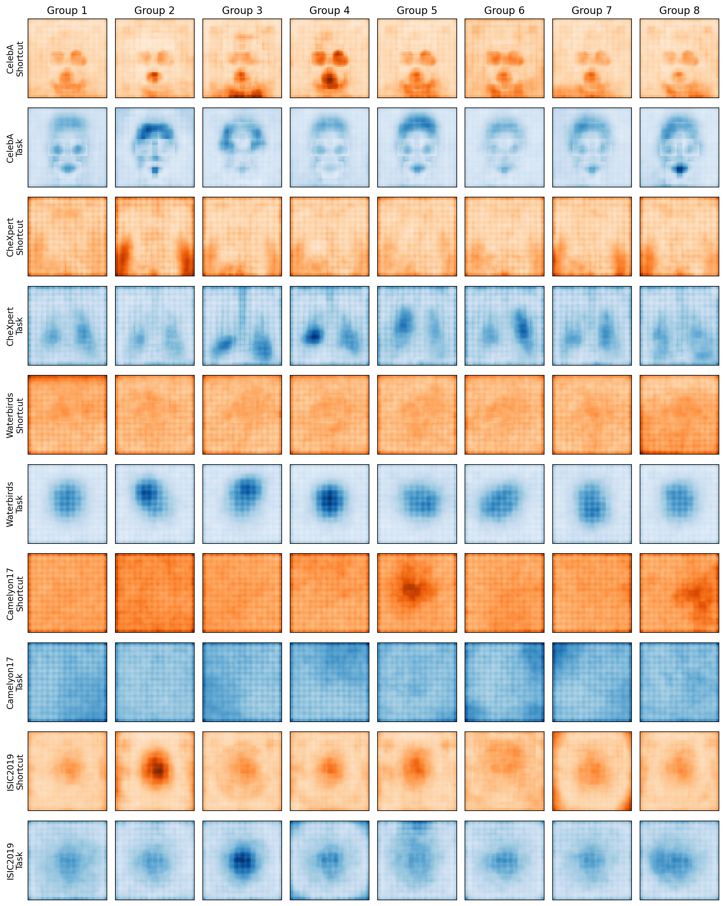

# Shortcut Groups

The problem of spurious correlations in AI is well known and several methods have been proposed for detection and mitigation of biases arising from spurious correlations. For natural datasets such as [Waterbirds](https://arxiv.org/abs/1911.08731), it is easier to interpret the locations of non-generalisable features that the model is relying upon, which is background in this case, are clearly visible and known. However, in cases where the source of bias is not well known or when the features are not easily interpretable (e.g. scanner or acquisition features) across prediction tasks, the auditors might want to understand the spatial evidence used for these features. [OSCAR](https://github.com/acharaakshit/oscar) was developed to localise such spurious and non-generlisable features by computing a shortcut or task based alignment score. However, OSCAR aggregated these features across the entire dataset which resulted in a single visualisation for shortcut and task localisation for a dataset. This could hide away different shortcut and task features occuring across a dataset. This repository contains code for finding multiple shortcut groups across datasets. These shortcut groups identify different shortcut and task patterns.



The basic object of interest is based on [OSCAR](https://github.com/acharaakshit/oscar), which compares regional attribution rankings from three models:

- `TS`: the task model being audited
- `BA`: a task model trained on balanced data
- `SA`: a model trained to predict the sensitive or spurious attribute

Based on the attribution rankings, we compute a partial correlation based shortcut or task alignment score and decompose it into specific image regions (which we ranked based on attributions) to obtain image level shortcut and task contribution maps where contributions indicate the contribution towards shortcut or task alignment score. These contributions can be further grouped into recurring patterns using K-means or NMF which we call as **shortcut groups**. Essentialy, these shortcut groups provide can be used to identify where different shortcut and task contributions appear, which images express each pattern, and whether those images are unusually error-prone.

## Why group contribution maps?

A single dataset-level contribution map assumes that shortcut evidence is spatially shared across images. This can hide heterogeneous shortcut patterns. Shortcut contribution may appear in different regions across subgroups, overlap with task contribution in some images, or be diffuse in medical imaging datasets.

Shortcut groups preserve the variations and provide rich information such as:

- shortcut contribution maps (prototypes) per shortcut group;
- task contribution maps (prototypes) per shortcut group;
- image-to-group membership scores indicating how asssociated each image is to a specific shortcut group;
- subgroup compositions and misclassification \% or error rates of images associated with various shortcut groups.

For example, when auditing blond-hair prediction on CelebA, task contribution is usually concentrated around the hair and forehead. Different shortcut groups can show shortcut contribution around mouth regions, earrings, or beard. The representative examples help inspect which images express each pattern and whether particular label–attribute combinations are associated with more errors.

## How it works

1. Partition the `TS`, `BA`, and `SA` attribution maps into the same spatial regions.
2. Convert the regional attributions into within-image rankings.
3. Compute shortcut and task contribution maps for each image using partial shortcut and task alignment scores (partial correlation decomposed into regions).
4. Concatenate the two maps into a joint shortcut/task representation.
5. Group the representations with K-means or non-negative matrix factorisation (NMF).
6. Inspect the spatial prototypes and the images with the strongest memberships.

For K-means, each image is assigned to one group whereas for NMF, we get soft memberships, which allow an image to express several recurring patterns i.e. each image can be a part of different shortcut groups with varying memebership strength or weight (if there are 4 shortcut groups, one image can have a weight of 0.6, 0.1, 0.2 and 0.1 for these shortcut groups). In our experiments, we find that NMF is usually the more useful choice for visual inspection and risk-based subset selection and intuitively as well, patterns can be mixed and therefore a membership based approach makese sense.

## Installation

Create a conda (or your choice) environment and install the package from this directory:

```bash
uv pip install -e ".[experiments]"
```

The K-means experiments additionally require a RAPIDS cuML installation
compatible with the local CUDA environment; the NMF workflow does not.

Clone the OSCAR repository into the parent folder (or a location of your choice), and install it:

```bash
uv pip install -e ../oscar
```

Set `PREFIX` to the directory containing the datasets, models, attribution rank pickle files and predictions:

```bash
export PREFIX=/path/to/data
```

## Quick start

The following example loads one attribution triplet, computes image-level contribution maps, and fits eight soft shortcut groups:

```python
import os

import numpy as np

from shortcut_groups.io import load_shortcut_task_maps
from shortcut_groups.prototypes import build_nmf_shortcut_groups

regions = 3136  # 56 x 56

maps = load_shortcut_task_maps(
    artifact_root=os.environ["PREFIX"],
    dataset="celeba_gender",
    model="vit",
    attribution_method="LRP",
    regions=regions,
    seed=0,
)

groups = build_nmf_shortcut_groups(
    maps["shortcut_evidence"],
    maps["task_evidence"],
    num_shortcut_groups=8,
)

memberships = groups["memberships"]
shortcut_group_prototypes = groups["shortcut_group_prototypes"].reshape(-1, 56, 56)
task_group_prototypes = groups["task_group_prototypes"].reshape(-1, 56, 56)

# Per-image group maps mix the group prototypes using each image's memberships.
image_shortcut_group_maps = groups["image_shortcut_group_maps"].reshape(-1, 56, 56)
image_task_group_maps = groups["image_task_group_maps"].reshape(-1, 56, 56)

# Ten images that most strongly express the first shortcut group.
representative_indices = np.argsort(memberships[:, 0])[-10:][::-1]
```

The main outputs are:

- `maps["shortcut_evidence"]`: non-negative shortcut contribution per image and region;
- `maps["task_evidence"]`: non-negative task contribution per image and region;
- `memberships`: an `N images × K groups` soft-membership matrix;
- `shortcut_group_prototypes` and `task_group_prototypes`: membership-weighted
  averages of the original image contribution maps;
- `image_shortcut_group_maps` and `image_task_group_maps`: per-image mixtures
  of those group prototypes used by group-level experiments.

NMF component scale is transferred into the image weights before memberships
are normalized. Per-image group maps are the normalized memberships times the
membership-weighted group prototypes.

## Examples

```
# compute risk from shortcut groups formed for waterbirds
python examples/evaluate_risk.py waterbirds --model vit
# plot the shortcut and task contribution patterns for all datasets
python examples/plot_shortcut_groups.py --model vit
```

## Datasets, models and attribution methods

The experiments are performed on the following datasets:

| Identifier | Prediction task | Sensitive or spurious attribute |
| --- | --- | --- |
| `CelebA` | Blond hair | Gender |
| `CheXpert` | Pleural effusion | Sex |
| `Waterbirds` | Bird type | Background |
| `Camelyon17` | Tumour | Medical centre |
| `ISIC2019` | Melanoma | Dataset source |

We use ResNet50 and ViT-B/16 models and the following attribution methods: LRP and Grad-CAM for ResNet50, and AttnLRP, ViT-CX, and TiS for ViT-B/16. In the repository, we refer to AttnLRP as `LRP`.

## Example experiments

### Held-out risk ranking

```bash
python -m exps.risk.risk_score_main_analysis
```

This fits shortcut groups on one subgroup-balanced split, estimates each group’s error rate, and ranks a separate held-out split by shortcut-group risk score. The same run also evaluates the ViT NMF grid-resolution sensitivity analysis.

### Input occlusion

```bash
python -m exps.occlusion.occlusion
```

This compares masks derived from dataset-level, shortcut-group-level, and image-level contribution maps.

### Internal spatial interventions

```bash
python -m exps.interventions.suppression_and_amplification
```

### Feedback and Issues

If you find any issues with installation or running the code, please feel free to raise an issue or [contact me](acharaakshit@gmail.com).
